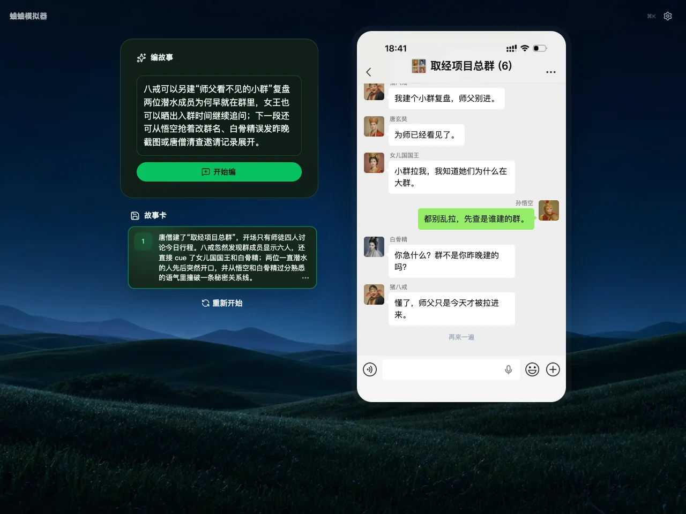

# 蛐蛐模拟器

一个用 React 构建的聊天记录短剧创作工具：选择预制剧情或输入下一段故事，让 DeepSeek 继续生成私聊、群聊和角色之间的对话，再预览语音、视频并导出可继续编辑的存档。微信版还提供默认关闭的多会话测试功能，可在设置中按需开启。

项目包含两套共用数据、生成和渲染能力的界面：

- **微信版**：短剧创作主版本，支持私聊、群聊、群头像和发言人姓名；在设置中开启“多会话（测试版）”后，可让多个私聊与群聊并行推进并显示未读消息。
- **钉钉版**：JOJO 公司群聊包装，保留独立的角色、素材和界面风格。

在线入口：

- 微信版：<https://ququ.mikeywa.icu/>
- 钉钉版：<https://ququ.mikeywa.icu/ding/>

公开仓库：[yanghaoleng/FakeChat](https://github.com/yanghaoleng/FakeChat)

## 微信版截图

西游记六人群聊预制本“取经项目总群”：



## 主要功能

- 使用预制本快速开场，或输入 Prompt 让 DeepSeek 按现有角色关系继续剧情。
- 微信版设置菜单提供“多会话（测试版）”开关，默认关闭；开启后，AI 才会按剧情新增角色和会话，让几条故事线并行推进。
- 多会话开启时，桌面端在微信窗口右侧显示会话头像轨与未读数量；移动端通过返回按钮和消息列表切换会话。
- 群聊使用组合头像并显示群成员姓名；每条消息通过 `sessionId` 和 `senderId` 归属到真实会话与角色。
- 内置 16 个微信预制本，包括六人西游群聊、九人 GTA 群聊、经典名著、影视和互联网人物剧情。
- 每次生成都会形成一张故事卡；删除、重新编辑或回到任意故事卡时，会同时恢复当时的角色和会话拓扑。
- 支持 `text`、`image`、`meme`、`music`、`transfer`、`system` 消息。
- 支持 Edge TTS 语音、Remotion 视频预览和浏览器端视频导出。
- 存档导出为带封面的 PNG，聊天项目 JSON 内嵌在图片中；也可以读取旧版 PNG 或 JSON 存档继续创作。

## 快速启动

安装依赖并复制本地配置：

```bash
npm install --registry=https://registry.npmjs.org/
cp .env.example .env
```

启动微信版前端：

```bash
STORY_PACKAGE=viral npm run dev
```

打开 <http://127.0.0.1:5173/>。预制本的第一段使用本地缓存，不需要模型；继续编写新剧情需要 DeepSeek。

同时启动前端与 Fastify API：

```bash
STORY_PACKAGE=viral npm run dev:fullstack
```

`npm run dev` 和 `npm run dev:fullstack` 不带 `STORY_PACKAGE` 时默认启动钉钉/JOJO 版。

## 构建与本地预览

分别构建两套独立产物：

```bash
npm run build
```

输出目录：

- `dist/viral`：微信版
- `dist/jojo`：钉钉版

生成与线上路由一致的组合包：

```bash
npm run build:ququ
```

组合包输出到 `dist/ququ`：微信版位于 `/`，钉钉版位于 `/ding/`。本地预览这套组合包可运行：

```bash
npm run preview:e2e
```

地址为 <http://127.0.0.1:4193/> 和 <http://127.0.0.1:4193/ding/>。

也可以单独启动带后端 API 的生产预览：

```bash
npm run preview:viral  # http://127.0.0.1:4174/
npm run preview:jojo   # http://127.0.0.1:4173/
```

## DeepSeek 配置

推荐把私有密钥放在服务端：

```dotenv
DEEPSEEK_API_KEY=
DEEPSEEK_BASE_URL=https://api.deepseek.com
DEEPSEEK_MODEL=deepseek-v4-flash
```

本地全栈模式通过 `/api/story/continue` 代理请求；Vercel 部署同样从项目 Environment Variables 读取 `DEEPSEEK_API_KEY`。

纯静态部署也可以配置 `VITE_DEEPSEEK_API_KEY`、`VITE_DEEPSEEK_BASE_URL` 和 `VITE_DEEPSEEK_MODEL` 让浏览器直连，但所有 `VITE_*` 值都会写进前端 bundle，不应放入需要保密的生产密钥。

模型不可用时会保留现有项目并显示明确错误，不会用固定套路伪造一次成功续写。Edge TTS 在浏览器端连接微软语音服务，网络策略拦截 WebSocket 时会在界面和控制台中报错。

## 多会话与数据格式

多会话目前是微信版的测试功能，默认关闭。需要使用时，打开右上角设置，启用“多会话（测试版）”；之后提交的新 Prompt 才会允许 DeepSeek 新建其他私聊或群聊。关闭开关只隐藏多会话入口并阻止后续新增会话，不会删除存档中已有的角色、消息和会话数据；再次开启即可继续切换。

项目在读取边界统一迁移为 Schema v2：

- `schemaVersion: 2`：当前项目版本。
- `selfCharacterId`：用户扮演的角色。
- `chatSessions[].kind`：`direct` 或 `group`。
- `chatSessions[].participantIds`：会话成员。
- `messages[].sessionId`：消息所属会话。
- `messages[].senderId`：消息发送者；`roleId` 仅保留为旧格式兼容字段。

`src/shared/schema.ts` 的 `parseProject()` 会把 v1、无版本以及旧 `chatMode` 项目线性迁移为规范 v2 数据。一个项目因此可以同时保留多条私聊和群聊，而不必把整个剧情强制转换成单一聊天模式。

## AI 续写机制

DeepSeek 只返回本轮 `GeneratedStoryDelta`，包含新增消息、必要的角色/会话拓扑变化和新增素材，不再重复传回完整项目。

发送给模型的历史也有明确上限：

- 最近 8 张故事卡摘要。
- 每个会话最多 12 条消息。
- 全项目最多 40 条消息。
- 最终用户上下文最多 24,000 字符。

多会话关闭时，模型只推进当前聊天，不会创建新的会话拓扑；开启后，较安静的会话仍会保留至少一条最近消息，避免活跃会话把并行故事线挤出上下文。服务端与浏览器模式共用同一套 Prompt、响应归一化和旧版完整项目响应兼容逻辑。

## 存档与故事回滚

当前 StoryArchive v2 为每张故事卡保存：

- 本段新增消息 ID。
- 生成前的角色、标题与会话拓扑。
- 生成后的角色、标题与会话拓扑。

因此删除或重新编辑某张故事卡时，可以精确恢复到对应时间点，而不是只截断消息数组。PNG 存档会把完整 JSON 写入 PNG `tEXt` 元数据，同时仍兼容旧版 JSON 和 v1 存档。

“重新开始”会随机载入另一套符合当前角色视角的预制剧情；不会复原刚刚删除的聊天记录。

## 代码结构

```text
src/
  App.tsx                              应用状态与故事编排
  components/UiPrimitives.tsx          轻量 UI 基础组件
  features/chat-preview/               微信聊天与多会话交互
  features/settings/                   设置和关于弹窗
  features/video/                      懒加载视频预览
  remotion/                            视频画面组件
  shared/chatSessions.ts               会话索引、未读与投影
  shared/multiSession.ts               AI 多会话生成约束与归并
  shared/messagePresentation.ts        界面、Canvas、Remotion 共用消息呈现
  shared/schema.ts                     Schema v2 与旧数据迁移
  shared/storySegments.ts              故事卡拓扑快照与回滚
  shared/storyGeneration/              DeepSeek 契约、Prompt、上下文与响应归一化
server/                                 Fastify 本地全栈 API
api/                                    Vercel Functions
e2e/                                    Playwright 关键流程
```

前端基于 Vite、React 19、Tailwind CSS、`@heroui/styles` 和自定义 UI primitives；视频使用 Remotion。视频预览、浏览器导出和 DeepSeek 客户端均按需加载，避免进入聊天页时下载整套媒体工具链。

## API

`npm run dev:fullstack` 默认在 `8787` 端口启动 Fastify：

- `GET /api/health`：健康检查。
- `GET/POST /api/settings/deepseek`：读取或更新本地 DeepSeek 配置；读取接口不返回明文密钥。
- `POST /api/story/continue`：生成下一段增量剧情。
- `GET /api/project/sample`：示例项目。
- `POST /api/script/generate`：从 Brief 生成剧情项目。
- `GET /api/memes/search`：搜索表情素材。
- `POST /api/tts/batch`：批量生成语音。
- `POST /api/render`：服务端渲染视频。

## 验证

```bash
npm run typecheck
npm test
npm run verify       # 单元测试 + 微信/钉钉组合构建
npm run verify:e2e   # Playwright 关键用户流程
```

持续集成分别运行单元/构建检查与 Playwright 浏览器回归，覆盖微信直聊、移动端布局、多会话测试开关、旧存档迁移、私聊/群聊切换、弹窗逐级返回以及钉钉路由。

## 素材与使用边界

- JOJO 图片素材使用真实办公室局部、手、背影和运动模糊，避免真实正脸。
- 表情包候选记录 `QFace`、`ChineseBQB`、`SOOGIF`、`sorrypy` 等来源及风险。
- 腾讯官方表情资源仅供学习交流；第三方素材没有明确授权时，不应直接用于商业发布。
